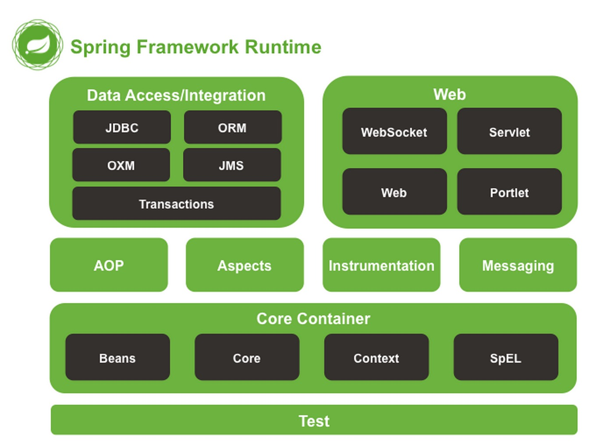

# Spring整体架构和环境搭建
--- 
## Spring整体架构

### 1. Core Container
Core Container：核心容器，包含Beans、Core、Context和Expression Language模块。Core和Beans模块是框架的基础部分，提供控制反转（IoC)和依赖
注入（DI）特性。

#### 1.1 Core
Core包含Spring框架基本的核心工具类，供其他模块使用。
#### 1.2 Beans
Beans在其他模块中都会用到，包含**访问配置文件、创建和管理bean以及进行Ioc/DI操作相关的所有类**。
#### 1.3 Context
① Context构建在Core和Beans模块基础之上，提供了一种类似JNDI注册器的框架式的对象访问方法。
② Context继承了Beans的特性，为Spring提供了大量的扩展，例如：国际化、事件传播、资源加载和对Context透明创建的支持。
③ Context同时也支持J2EE的一些特性，例如EJB、JMX和基础的远程处理。
#### 1.4 Expression Language
Expression Language提供了一个用于在运行时查询和操作对象的表达式语言。

### 2. Data Access/Integration
Data Access/Integration：数据访问/集成，包含JDBC、ORM、OXM、JMS和Transactions模块。
#### 2.1 JDBC (Java Database Connect)
JDBC 提供了一个JDBC的抽象层，消除JDBC编码和解析数据库厂商的错误代码。Spring封装了所有对JDBC访问的类。
#### 2.2 ORM (Object Relation Mapping)
ORM 是流行的对象-关系映射API，如JPA、JDO、Hibernate、iBatis等。提供了一个交互层。利用ORM封装包，可以混合使用所有Spring提供的特性进行O/R映射。
#### 2.3 OXM (Object XML Mapping)
OXM提供了一个队Object/XML映射的实现层。实现包括：JAXB、Castor、XMLBeans、JiBX和XStream。
#### 2.4 JMS (Java Messaging Service)
JMS提供了一些生产和消费消息的特性。
#### Transaction
Transaction支持编程和声明性的事务管理。

### 3. Web
Web上下文模块建立在应用程序上下文模块之上，为基于Web的应用程序提供上下文。Web层保护了Web、Web-Servlet、Web-Struts和Web-Portlet模块。
#### 3.1 Web
Web提供了基础的面向Web的集成特性。
#### 3.2 Web-Servlet
Web-Servlet包含Spring的MVC（model-view-controller）实现。
#### 3.3 Web-Struts
Web-Struts提供了对Struts的支持，使得类在Spring应用中能够与一个典型的Struts Web层集成在一起。
#### 3.4 Web-Porlet
Web-Portlet提供了用于Portlet环境和Web-Servlet模块的MVC的实现。

### 4. AOP
AOP模块提供了一个符合AOP联盟标准的面向切面编程的实现。
#### 4.1 Aspects
Aspects提供了对AspectJ的支持。
#### 4.2 Instrumentation
Instrumentation提供了class instrumentation支持和classloader实现，使得可以在特定的应用服务器上使用

### 5. Test
Test模块支持使用JUnit和TestNG对Spring组件进行测试。

---

# 容器的基本实现
---

